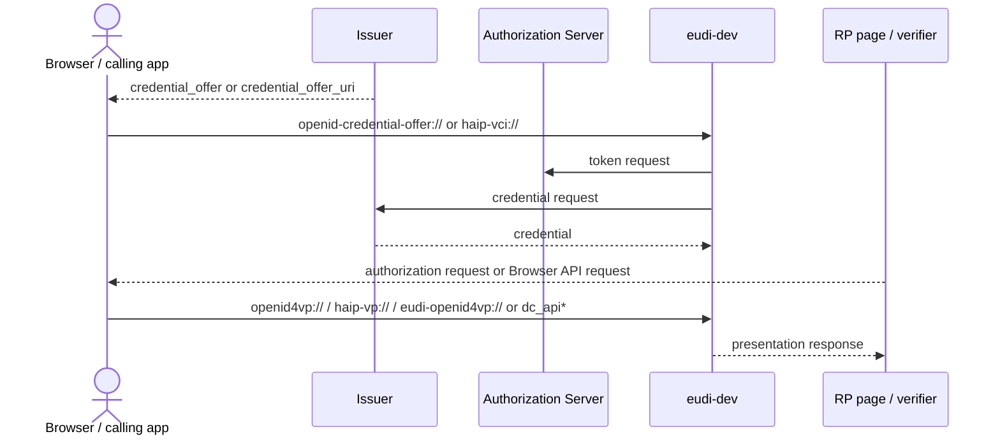
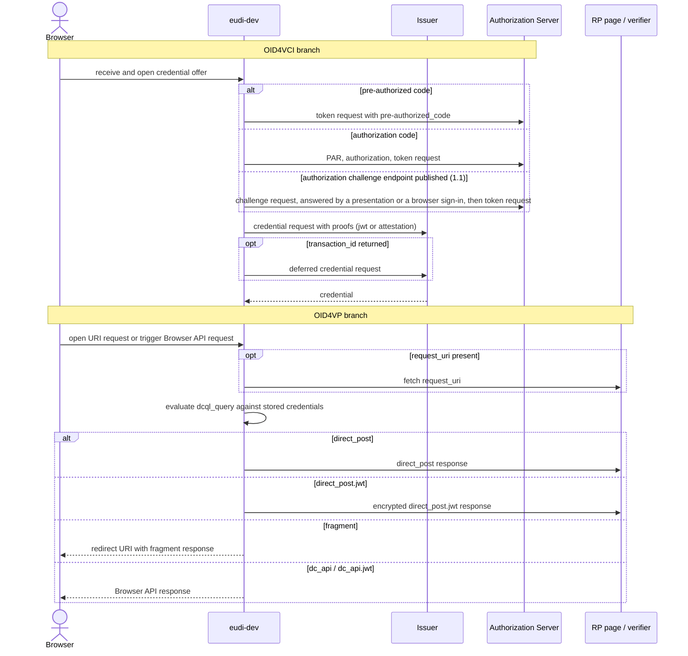

# Flow Diagrams

These Mermaid diagrams show how `eudi-dev` interacts with issuers and verifiers. Each page also lists the request parameters and wallet flags that affect the flow.

## Pages

| Page | Scope |
|------|-------|
| [OID4VP Flows](./oid4vp.md) | Presentation request variants, response modes, Browser API, and request-object handling |
| [OID4VCI Flows](./oid4vci.md) | Credential offer variants, grant flows, and the credential request branches |

## Whole Interaction

## Supported Flow Map

## Reading Guide

- [OID4VCI Flows](./oid4vci.md) shows how credentials get into the wallet.
- [OID4VP Flows](./oid4vp.md) shows how the wallet selects and returns stored credentials.
- The parameter tables on each page list the request fields and wallet flags that change behavior.
