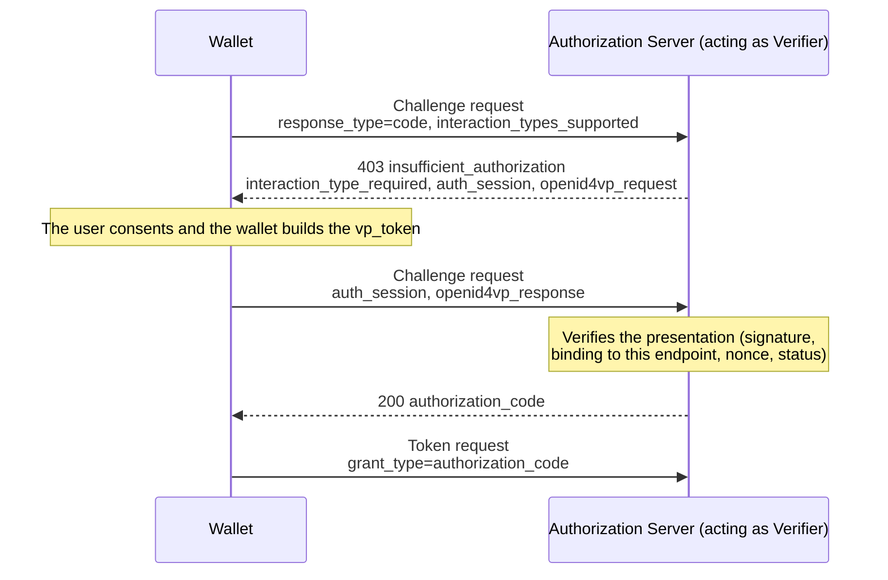

[← Wallet](../wallet.md)

# Issuing into the wallet

The wallet accepts a credential offer with [`wallet accept`](presenting.md#wallet-accept-uri), from the wallet UI, from a scanned QR, or at its `/credential-offer` URL.

## Sign-in during issuance

An authorization code offer requires sign-in at the issuer. The wallet returns the authorization URL because a hosted server cannot open a browser itself. An open wallet tab receives the URL through the event stream and navigates to it.

API callers receive `HTTP 202` with the URL. They should open it only when no wallet tab is handling the flow, so the authorization request is used once:

```json
{
  "status": "authorization_required",
  "authorization_url": "https://issuer.example/authorize?client_id=...&request_uri=...",
  "offer_id": "23f9dd49-7e7b-4fca-9fbe-acba4680852f"
}
```

After sign-in, the issuer redirects to `/callback` and the wallet resumes issuance. Poll `GET /api/offers/{offer_id}` for `authorization_required`, `completed`, `deferred` or `failed`. Deferred and failed responses carry the same payloads as a direct response.

The callback is matched by `state` alone, so the sign-in can happen in any browser that can reach the wallet's redirect URI. `eudi wallet accept` uses this. It opens the URL locally, prints it for a headless shell, and polls the offer until it completes.

## Renewing a credential

An issuer that returns a refresh token at issuance can be asked for a new copy of the credential later. The wallet stores what the request needs (token and credential endpoints, configuration id, refresh token) with the credential.

```bash
eudi wallet refresh <credential-id>
curl -X POST http://localhost:8085/api/credentials/<id>/refresh
```

The credential keeps its id, so a verifier query or a UI selection that referred to it keeps working. A rotated refresh token replaces the stored one. Credentials that can be renewed report `can_renew` in listings, alongside `expires_at` (read from `exp` for SD-JWT and from the MSO validity for mdoc).

A refresh is a token request (`grant_type=refresh_token`) at the endpoint that issued the credential, with the same client authentication. The wallet stores how it authenticated (wallet attestation or `private_key_jwt`, with the audience and the challenge endpoint) alongside the refresh token and rebuilds it per request. The attestation challenge is fetched fresh each time.

The server checks for renewal every 30 seconds and renews credentials within a minute of expiry. Failed renewals wait ten minutes before retrying. The wallet also attempts renewal before presenting a credential that close to expiry, including without a running server. If renewal fails, it presents the stored credential.

## Deferred issuance

An issuer that cannot produce the credential straight away answers the credential request with a `transaction_id`. The wallet collects the credential from the `deferred_credential_endpoint` later, in both issuance flows.

While the credential is not ready the issuer answers with the `issuance_pending` error and an `interval` to wait ([OID4VCI 1.0 §9.3](https://openid.net/specs/openid-4-verifiable-credential-issuance-1_0.html)). The wallet waits that interval. Some issuers echo the `transaction_id` back in a success response instead, which the wallet accepts too.

The wallet records the transaction and returns straight away. `wallet serve` collects the credential in the background on the issuer's interval, so a consent dialog or a CLI run never waits for it.

Accepting such an offer answers `HTTP 202` with the outcome:

```json
{
  "pending": true,
  "issuer": "https://playground.animo.id/oid4vci/a27a9f50-...",
  "transaction_id": "6a02ebb4-a256-4c71-a0dc-af1e5a7c1495",
  "retry_interval": "1m0s"
}
```

The wallet UI lists it under **Awaiting issuance** and the credential appears once collected. From the CLI:

```bash
eudi wallet deferred                 # what is outstanding, and when the next attempt is
eudi wallet deferred check [id]      # ask the issuer now instead of at the next attempt
eudi wallet deferred abandon <id>    # stop collecting it
```

**Check now** polls immediately and reports the result: a credential, `issuance_pending` or a refusal. It schedules the next attempt one interval later. The UI offers the same action.

**Abandon** drops the entry from the schedule. The transaction stays valid at the issuer.

Deferred issuances are saved in the selected storage backend. With file or Postgres storage, collection resumes after a restart. A record is removed when collection succeeds, the issuer returns a final error, the user abandons it, or 24 hours pass. A local `wallet accept` command reports the deferral. Run `wallet serve` to collect the credential.

## Wallet attestation

On OID4VCI token requests the wallet authenticates itself with a wallet attestation ([OAuth 2.0 Attestation-Based Client Authentication](https://datatracker.ietf.org/doc/draft-ietf-oauth-attestation-based-client-auth/)), sent as the `OAuth-Client-Attestation` and `OAuth-Client-Attestation-PoP` headers. The attestation is signed by the wallet's own CA and carries only the leaf in `x5c`, so an issuer verifying it needs the CA from `wallet ca-cert` as its trust anchor. The same client authentication applies at every authorization server endpoint the wallet calls: the PAR endpoint, the token endpoint, and the Authorization Challenge Endpoint of interactive authorization (OpenID4VCI 1.1 section 6).

The wallet supports three drafts of the attestation specification ([ADR-0014](../adr/0014-pinned-draft-versions-stay-supported-alongside-the-latest.md)). Outgoing JWTs use the draft-07 claims required by OpenID4VCI 1.0 section 14.7. Both the attestation and its PoP include `iss` and `nbf`, regardless of `--vci-version`. Draft-08 allows these additional claims under sections 5.1 and 5.2 rule 1, so the same JWTs work across the supported drafts.

Draft-10 features are selected through server metadata. If a server offers only `attest_jwt_client_auth_dpop`, or lists only `dpop_combined` in `client_attestation_pop_methods_supported`, the wallet uses DPoP as the possession proof and omits the dedicated PoP header. It warns when this mechanism is newer than the configured draft.

A server can request an attestation challenge through the `OAuth-Client-Attestation-Challenge` response header or the `use_attestation_challenge` error. The wallet includes the challenge in its next PoP and retries once. It also supports the `challenge_endpoint` advertised in metadata.

Under `--haip` the wallet always attests. HAIP 1.0 §4.4.1 requires it of both sides:

> Wallets MUST use, and Issuers MUST require, an OAuth2 Client authentication mechanism at OAuth2 Endpoints that support client authentication (such as the PAR and Token Endpoints).

Debug mode, used by the public demo, handles two issuer deviations:

- An issuer that requires an attestation but advertises no client authentication method. Advertising is a SHOULD in §10.1, so the wallet attests anyway and warns about the missing advertisement.
- An issuer that advertises only unauthenticated access (`none`). The wallet proceeds without client authentication and warns.

`--mode strict` attests in both cases and lets the exchange fail at the token endpoint if the issuer refuses.

Without `--haip` the wallet attests **only when the authorization server advertises it** by listing `attest_jwt_client_auth` in `token_endpoint_auth_methods_supported`. §8 of the draft asks a client to do that:

> The client SHOULD fetch and parse the Authorization Server metadata and recognize Attestation-Based Client Authentication as a client authentication mechanism if either of the given `token_endpoint_auth_methods_supported` values are present.

Following the metadata also limits correlation. The wallet has one holder key and one attestation, and §10.1 of the draft warns that reusing them across authorization servers lets those servers correlate the user.

### `--client-attestation`

Advertising the method is a SHOULD, so an issuer may require an attestation without announcing it. `--client-attestation` sends the attestation regardless of metadata:

```bash
eudi wallet serve --client-attestation --auto-accept
```

Use it for issuers that require an attestation but omit it from their metadata. Reusing the attestation allows those issuers to correlate the wallet. `GET /api/config` reports the setting as `force_client_attestation`. An authorization server that advertises `private_key_jwt` still gets the client assertion.

## OpenID4VCI feature level

The wallet implements [OpenID4VCI 1.0](https://openid.net/specs/openid-4-verifiable-credential-issuance-1_0-final.html), the published final version. `--vci-version` decides whether it also uses what the [1.1 draft](https://openid.github.io/OpenID4VCI/openid-4-verifiable-credential-issuance-1_1-wg-draft.html) adds.

```bash
eudi wallet serve --vci-version 1.1
```

`1.0` is the default. The public demo runs `1.1` (`--demo` selects it, `--vci-version 1.0` overrides that).

Every 1.1 feature is negotiated in the issuer's metadata, so 1.1 behaves like 1.0 against an issuer that publishes none of them.

Like the other conformance settings, the level is changeable at runtime on a locally hosted wallet (see [changing the conformance settings](serve.md#changing-the-conformance-settings)) and reported as `vci_version` by `GET /api/config`.

What 1.1 selects:

| Feature | 1.0 | 1.1 |
|---------|-----|-----|
| Interactive Authorization (1.1 §6), where the issuer publishes `authorization_challenge_endpoint` | Not used. The activity log mentions the flag that would use it, and the redirect flow of §5 runs | Used. See [interactive authorization](#interactive-authorization) |

### Interactive authorization

An issuer can make presenting a credential a condition of issuing one. The wallet calls the issuer's Authorization Challenge Endpoint. The issuer answers with an OpenID4VP request. The wallet asks the user and presents what was asked for, and the issuer verifies the presentation as a verifier would. Then it returns an authorization code, and the ordinary token and credential exchange follows.



Steps 2 and 3 repeat while the issuer asks for further interactions. A wallet that cannot satisfy one answers with an OpenID4VP error, so the issuer can report why it refuses.

The presentation asks for consent like any other, since receiving a credential and disclosing one are separate decisions. A wallet in auto-accept mode answers for the user.

Challenge requests carry the same wallet attestation headers as token requests, and the built-in demo issuer requires them there unless started with `--demo-issuer-client-auth optional`.

The presentation interaction works without `--vci-redirect-uri`. An issuer that sets `require_interactive_authorization` issues only through interactive authorization. The presentation is bound to the challenge endpoint itself. An SD-JWT key binding JWT carries it as `ia:<endpoint>` in `aud`, and an mdoc signs over the `OpenID4VCIIAEHandover` session transcript. An `expected_origins` in the request must contain the challenge endpoint's own origin, which stops one authorization server from forwarding another's request.

The wallet offers two interactions and advertises only what it can complete (§6.2.1):

- The presentation interaction (`urn:openid:dcp:ia:openid4vp_presentation`), always.
- The browser interaction (`urn:openid:dcp:ia:auth_via_web`, §6.2.1.2), when a redirect URI is configured and the server publishes an `authorization_endpoint`. The server answers the challenge with a `request_uri`. The wallet builds an authorization request from it (RFC 9126 §4) and opens the sign-in URL in the user's browser, as in the redirect flow. The redirect back to the wallet carries the authorization code, or an `auth_session` when further steps remain at the challenge endpoint.

A server asking for an interaction the wallet did not advertise is refused.

The built-in demo issuer uses both. An offer set to "Presentation during issuance" runs the presentation interaction. An offer set to "Browser sign-in" requests the `auth_via_web` interaction from a wallet that advertises it, and falls back to `redirect_to_web` (first-party-apps Section 5.2.2.1.1) for other wallets.

#### Trying it against the built-in demo issuer

The built-in demo issuer implements the issuer side, so the exchange runs against a single `wallet serve`. It asks for a PID, verifies the presentation, and issues a ticket for that PID's holder.

```bash
eudi wallet serve --pid --auto-accept --vci-version 1.1 --vci-client-id demo-wallet

# an authorization code offer whose authorization is a presentation
curl -X POST 'http://localhost:8085/issuer/api/offers?grant=authorization_code&authorization=presentation' -d '{}'
curl -X POST http://localhost:8085/api/offers -d '{"uri": "<scheme_uri from above>"}'
```

`authorization=presentation` selects "Presentation during issuance" for this offer. Without it the offer defaults to the browser sign-in. The same offer redeemed at `--vci-version 1.0` goes through the browser sign-in, because the demo issuer publishes `authorization_challenge_endpoint` only at 1.1.
