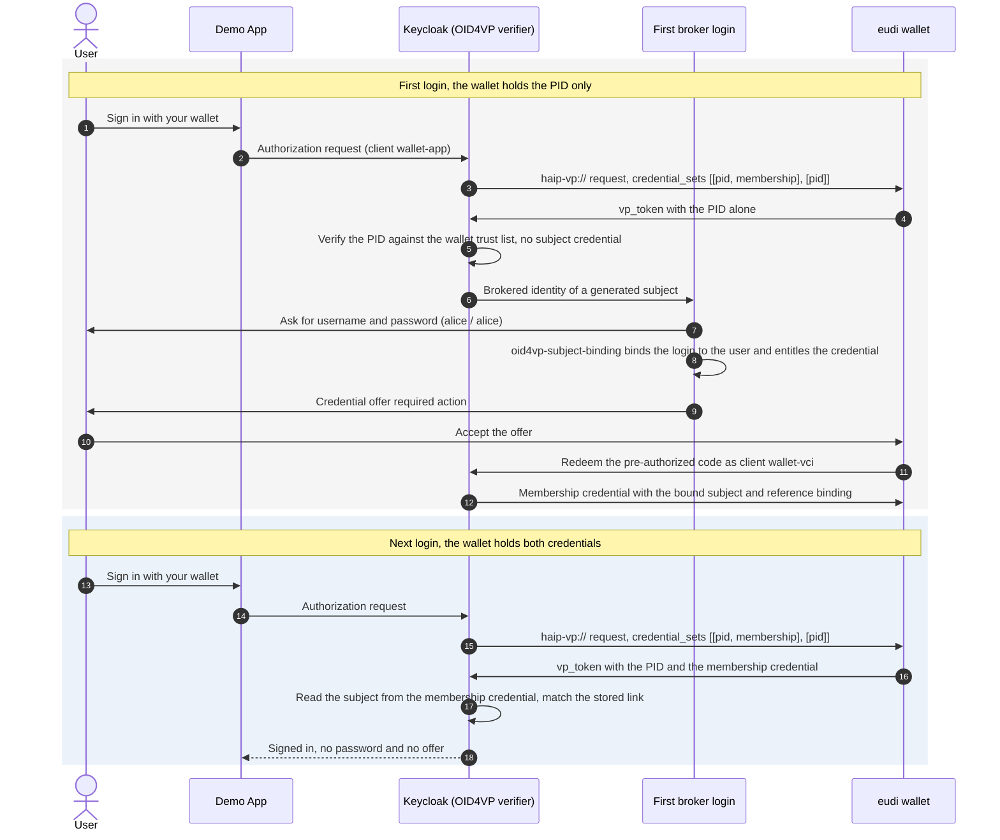

# Keycloak Issuer + Verifier Demo App

This example runs Keycloak as an OpenID4VP verifier that signs users in with their wallet, and issues them a credential during that login. It uses the `keycloak-extension-oid4vp` subject-binding model.

The wallet starts with an EUDI PID. On the first login, Keycloak also asks for the account password and issues a membership credential bound to that account.

Later logins present both credentials. Keycloak reads the account subject from the membership credential and signs the user in without another password.

The example starts Keycloak (26.7.2), a local `eudi wallet serve --docker` wallet holding the PID, and a Go relying party. Everything runs locally over HTTP.

## The Flow



## How It Works

The static realm import (`realm/wallet-app-demo-realm.json`) carries the whole configuration.

- The `oid4vp` identity provider enforces HAIP (`x509_hash`, `direct_post.jwt`) and requests `credential_sets` `[[pid, membership], [pid]]`. `allowMissingSubjectCredential` accepts the PID alone, and `principalAttributes` reads the subject from `membership:sub`.
- The first broker login flow runs `idp-username-password-form` followed by `oid4vp-subject-binding`. The authenticator binds the login to the user, entitles them to the `membership-credential` configuration, and offers it through the credential-offer required action to the client `wallet-vci`.
- The `membership-credential` scope issues an SD-JWT credential whose `oid4vp-bound-subject-mapper` writes the opaque subject and a reference credential binding. The binding ties the credential to the PID it was issued next to (a keyed digest of the PID mandatory attributes), so the membership credential cannot sign a user in next to a different person's PID.
- Trust is resolved per credential. The `pid-trust-list` provider (an `etsi-trust-list`) serves the PID trust anchors from the wallet, and the `keycloak-realm-issuer` provider verifies the membership credential against this realm's own signing keys.

`bootstrap.sh` adds the runtime piece the import cannot carry: a CA-issued RS256 realm signing key (Keycloak refuses to issue an SD-JWT credential signed with a self-signed certificate). `docker-compose.yml` trusts the wallet CA so Keycloak can reach the wallet status list over HTTPS.

## Quick Start

```bash
cd examples/keycloak-issuer-verifier-app
./start.sh
```

If `eudi-dev` is not installed, `start.sh` installs the latest release with `go install github.com/dominikschlosser/eudi-dev@latest`.

Open the demo app at `http://127.0.0.1:8090` and choose "Sign in with your wallet". The first login asks for the `alice` / `alice` password and issues the membership credential into the wallet. Sign out and sign in again to see the passwordless login.

Headless check of the same flow:

```bash
./start.sh --smoke
```

Start the stack and leave it running for manual exploration:

```bash
./start.sh --setup-only
./scripts/smoke.py
```

## Files

- `start.sh`: seeds the wallet with a PID, starts the wallet and Keycloak, bootstraps the signing key, and runs the app or the smoke check
- `docker-compose.yml`: Keycloak with the OID4VP provider jar, the realm import, and the wallet CA in its truststore
- `realm/wallet-app-demo-realm.json`: the verifier, the subject-binding first broker login flow, the membership credential scope, and the trust material
- `scripts/download-extension.sh`: downloads `keycloak-extension-oid4vp` `0.11.1`
- `scripts/generate-keycloak-signing-cert.sh`: creates the CA-issued RS256 realm signing key
- `scripts/bootstrap.sh`: imports the signing key and allows the master admin over HTTP for the local demo
- `scripts/start-app.sh`: starts the Go relying party
- `scripts/smoke.py`: drives the first (password plus offer) and second (passwordless) wallet login
- `app/`: the relying party, its templates, and its CSS

## Cleanup

```bash
docker compose down -v
eudi wallet remove --all
rm -f wallet-ca-cert.pem keycloak-signing-*.pem
```
