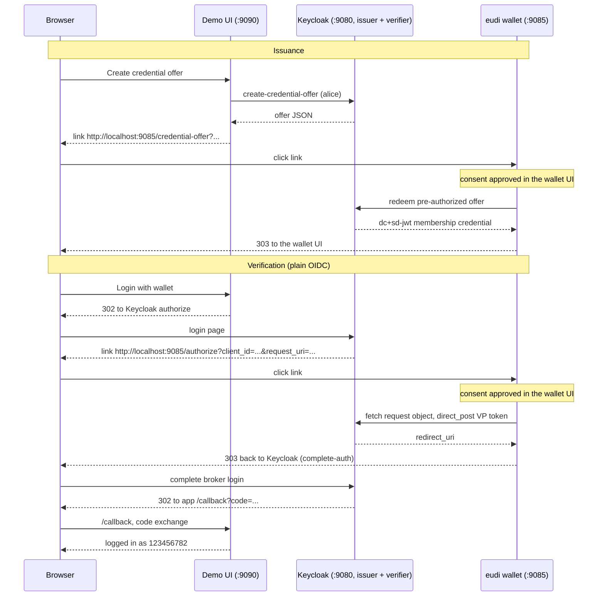

# Keycloak + Web Wallet (Web URLs Instead of Custom Schemes)

Run a Keycloak issuer, a Keycloak verifier (`keycloak-extension-oid4vp`) and the `eudi-dev` web wallet in one Docker compose project. Issuance and presentation use the wallet's localhost web endpoints. Verification starts through a normal OIDC browser login.

This wallet implements OS registration for custom URL schemes only on macOS. Containers and other platforms can use web endpoints with the same query parameters:

| Custom scheme | Wallet URL |
|---------------|------------|
| `openid4vp://?<params>` or `openid4vp://authorize?<params>` | `http://localhost:9085/authorize?<params>` |
| `openid-credential-offer://?<params>` | `http://localhost:9085/credential-offer?<params>` |

When a browser navigates to those URLs, the wallet behaves like a same-device wallet app: it presents (or imports) and then redirects the browser onward, either to the verifier's `redirect_uri` or into the wallet UI. See [Invoking the wallet by URL](../../docs/wallet/presenting.md#invoking-the-wallet-by-url).

## Quick Start

```bash
cd examples/keycloak-web-wallet
./start.sh
```

`start.sh` downloads the verifier extension, exports the wallet CA for Keycloak's truststore, starts everything, configures the verifier's wallet links, and runs both headless demos. Then open the **demo UI** at <http://localhost:9090>:

- **Issuance**: creates a credential offer in Keycloak and shows a clickable `http://localhost:9085/credential-offer?...` link (plus the equivalent custom-scheme URI). Clicking it delivers the offer to the wallet and lands in the wallet UI, which shows the consent request. Approving imports the membership credential.
- **Verification**: "Login with wallet" is a plain OIDC login: the browser goes to Keycloak, whose login page links directly to `http://localhost:9085/authorize?...` (the identity provider's `walletScheme` is configured with the wallet URL). The link lands in the wallet UI showing the consent request. Approving presents the PID credential, sends the browser back to Keycloak, and the login completes at the app's `/callback` with the ID-token claims on screen. **Logout** ends the session via OIDC RP-initiated logout against Keycloak's `end_session_endpoint` (`post.logout.redirect.uris` is configured on the `wallet-mock` client), so the next login requires the wallet again.

Browser flows open the wallet UI and wait for consent. The headless scripts request interactive handling explicitly and approve through the consent API.

To run the headless demos individually:

```bash
./start.sh --setup-only
docker compose run --rm demo demo-issuance.py
docker compose run --rm demo demo-verification.py
```

The default host ports (Keycloak `9080`, wallet `9085`, demo UI `9090`) avoid the wallet's and Keycloak's standard ports, so the example runs alongside a locally running `eudi-dev` wallet or Keycloak. If a port is taken anyway, `start.sh` picks the next free one automatically and prints what it chose. To pin the ports yourself, override them explicitly:

```bash
KEYCLOAK_PORT=18080 WALLET_PORT=18085 APP_PORT=18090 ./start.sh
```

## How It Works

Services share Keycloak's network namespace through `network_mode: service:keycloak`. Published host ports match the ports used inside it, so browser links and container requests can use the same `localhost` URLs. Set port overrides together to preserve this mapping.

Services:

- `keycloak`. Keycloak `26.7.2` with OID4VCI enabled and the `keycloak-extension-oid4vp` provider jar, importing two static realms: `oid4vc-demo` (issuer, from the `keycloak-issuer-wallet` example) and `wallet-demo` (verifier, from the `keycloak-verifier-oid4vp` example)
- `wallet`. `eudi-dev` built from this repository, running `wallet serve --pid --base-url http://localhost:9085` (interactive mode: presentations and offers wait for consent in the wallet UI)
- `app`. The demo UI (`app/app.py`, Python stdlib): an ordinary OIDC client of the `wallet-demo` realm plus an issuance helper that turns Keycloak offers into wallet links
- `demo`. A one-shot container for the headless demo scripts
- `wallet-init`. Setup-only helper to export the wallet CA before Keycloak starts

`start.sh` runs `scripts/configure-wallet-links.py` after startup, which sets the `oid4vp` provider's `walletScheme` to `http://localhost:<wallet-port>/authorize` and the `demo-trust-list` provider's `trustListUrl` to the wallet's trust list via the admin API. From then on Keycloak's login page links straight to the wallet.

Keycloak `26.7.2` notes: the `create-credential-offer` REST endpoint sits behind the `oid4vc-vci-rest-credential-offer` feature flag, and offers can only be created for credentials assigned to the user. The demo assigns `membership-credential` to `alice` via the admin API (`POST /admin/realms/{realm}/users/{id}/vc/credentials`) before creating an offer.

**Extension version**: this example uses `keycloak-extension-oid4vp` `0.11.1`, downloaded by `scripts/download-extension.sh`. A local checkout of the extension next to this repository (or pointed to via `KEYCLOAK_OID4VP_REPO`) is preferred when present, so changes to the extension can be tested before release.

### Issuance (`demo-issuance.py`)

1. Gets a user token for `alice` and calls Keycloak's `create-credential-offer` endpoint (assigning the credential to the user first, as 26.7.2 requires).
2. Resolves the one-shot offer URI and inlines the offer JSON (same reasoning as in `keycloak-issuer-wallet`).
3. Invokes `GET http://localhost:9085/credential-offer?credential_offer=...`. The wallet waits for consent, the script approves it via `POST /api/requests/{id}/approve`, and the wallet redeems the offer against Keycloak and stores the membership credential.

### Verification (`demo-verification.py`)

1. Starts an OIDC login for the `wallet-mock` client in the `wallet-demo` realm.
2. Takes the wallet link from the extension's login page. After `configure-wallet-links.py` this is the wallet's `/authorize` URL.
3. GETs it. The wallet fetches the request object and waits for consent. The script approves it via `POST /api/requests/{id}/approve`, and the wallet presents the PID credential via `direct_post` and returns the verifier's `redirect_uri`.
4. Completes the broker flow with that redirect and exchanges the authorization code. The login lands as the PID subject (`preferred_username=123456782`, mapped from `personal_administrative_number`).



## Trust Material

- The wallet's PID credentials chain to the shared wallet CA. The verifier validates them against the wallet's trust list at `http://localhost:9085/api/trustlist`.
- The credentials embed a status list at the wallet's HTTPS issuer endpoint (`https://localhost:9086/api/statuslist`). `start.sh` exports the wallet CA (`wallet-ca-cert.pem`) into Keycloak's TLS truststore so the extension's revocation check can fetch it. The wallet state lives in a named volume so the CA stays stable across restarts.

## Files

- `start.sh`: downloads the extension, exports the wallet CA, starts the services, configures the wallet links, runs both demos
- `docker-compose.yml`: Keycloak (issuer + verifier), the wallet, the demo UI, and the demo runner. One shared network namespace
- `app/app.py`: the demo UI (OIDC client + issuance link helper)
- `realm/oid4vc-demo-realm.json`: issuer realm (copy of `keycloak-issuer-wallet`)
- `realm/wallet-demo-realm.json`: verifier realm (copy of `keycloak-verifier-oid4vp`)
- `scripts/oid4vp_demo.py`: shared flow helpers used by the demos and the UI
- `scripts/configure-wallet-links.py`: points the `oid4vp` provider's `walletScheme` and the `demo-trust-list` provider's `trustListUrl` at the wallet
- `scripts/download-extension.sh`: downloads `keycloak-extension-oid4vp`
- `scripts/wait-ready.sh`: waits for both realms and the wallet
- `scripts/demo-issuance.py`: issuance via `GET /credential-offer`
- `scripts/demo-verification.py`: verification via `GET /authorize`

## Cleanup

```bash
docker compose down -v
rm -f wallet-ca-cert.pem providers/keycloak-extension-oid4vp.jar
```
